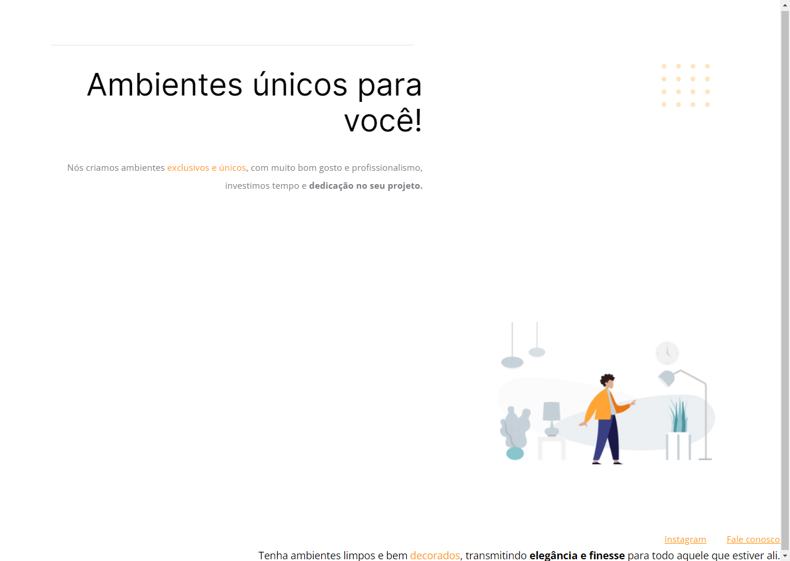

# Explorer Stage 02 - Corrigindo Bugs 🔍

## Sobre o desafio 💻

>Nesse desafio recebemos um código com bugs propositais a fim de testar os alunos do programa Explorer, o código sofreu algumas alterações e como podemos ver na imagem abaixo, ele não está mais da mesma forma que deixamos 🛠

## Desafio concluído ✔

## ⚙ Tecnologias
- HTML
- CSS

[🔗 Clique aqui para acessar](https://brunakarina.github.io./corrigindo-bugs/)

## 📫 Contato
- brubskarina@gmail.com